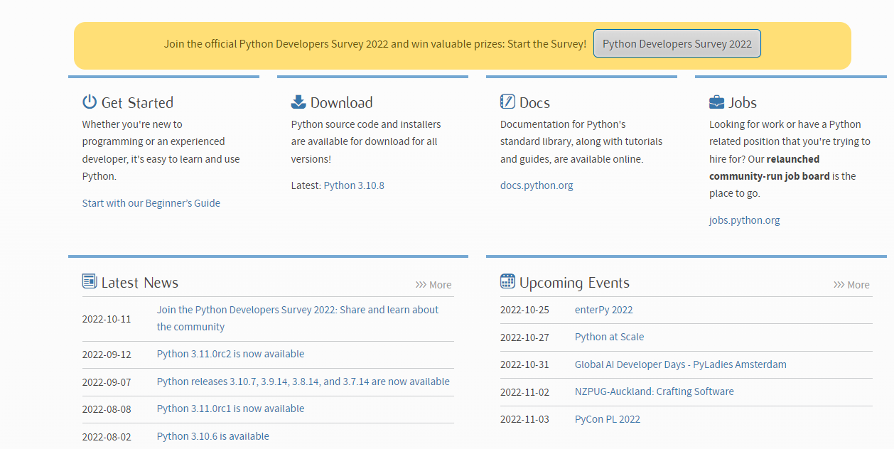
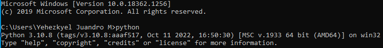
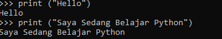
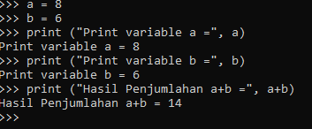
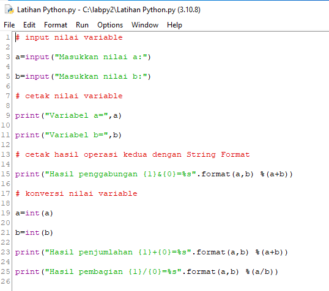
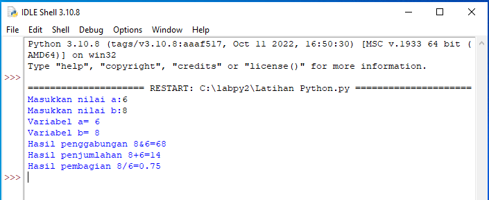
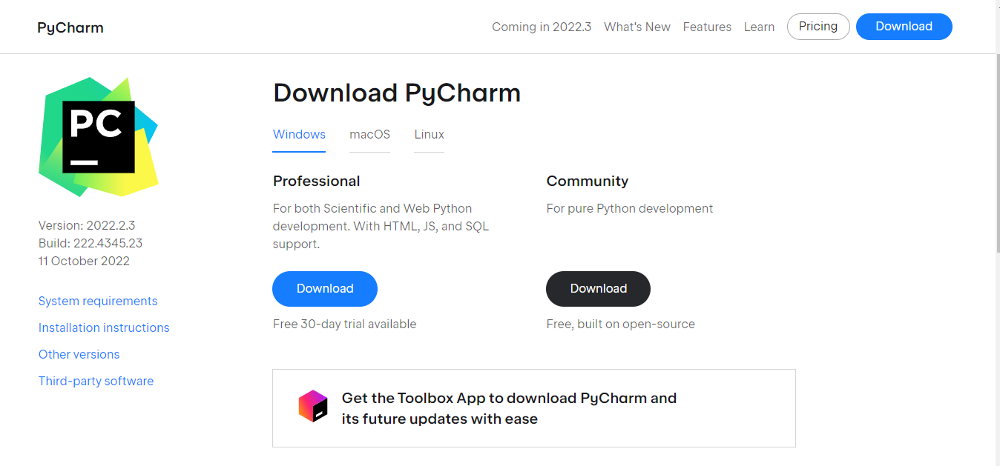
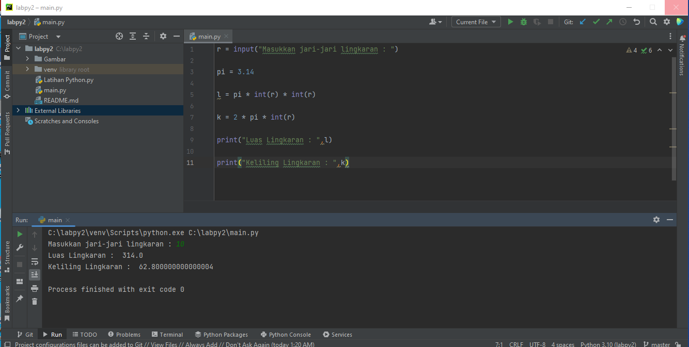

# Langkah-Langkah penggunaan python

1. Pertama Download https://www.python.org/downloads/

2. Menjalankan Phyton di Command Prompt

> python

3. Memanggil Input

> print("Hello)

> print("Saya sedang belajar Phyton)

4. Menjumlahkan dua buah bilangan menggunakan variabel a dan b

> a = 8

> b = 6

> print ("variabel a=",a)

> print ("variabel b=",b)

> print ("hasil penjumlahan a+b",a+b)

5. Menjalankan IDLE

Menggunakan fungsi Input untuk mengambil nilai variabel dari keyboard

> input nilai variable

> a=input("Masukkan nilai a:")

> b=input("Masukkan nilai b:")

> cetak nilai variable

> print("Variabel a=",a)

> print("Variabel b=",b)

> cetak hasil operasi kedua dengan String Format

> print("Hasil penggabungan {1}&{0}=%s".format(a,b) %(a+b))

> konversi nilai variable

> a=int(a)

> b=int(b)

> print("Hasil penjumlahan {1}+{0}=%s".format(a,b) %(a+b))

> print("Hasil pembagian {1}/{0}=%s").format(a,b) %(a/b))

Lalu coba klik run

6. Selanjutnya Download Pycharm https://www.jetbrains.com/pycharm/download/#section=windows

7. Menghitung Luas dan Keliling Lingkaran dengan PyCharm

> r = input("Masukkan jari-jari lingkaran : ")

> pi = 3.14

> l = pi * int(r) * int(r)

> k = 2 * pi * int(r)

> print("Luas Lingkaran : ",l)

> print("Keliling Lingkaran : ",k)

